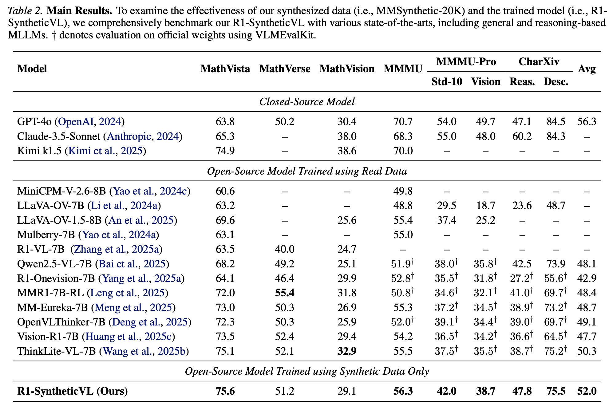
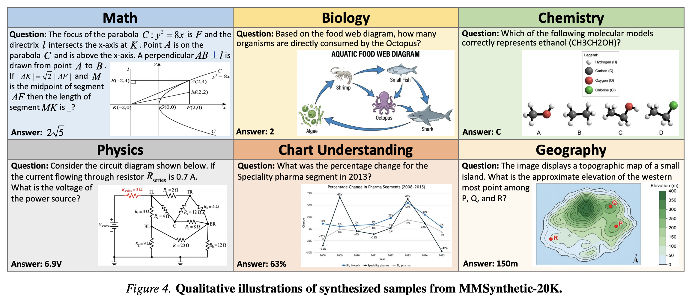

<div align="center">

<h1> R1-SyntheticVL: Is Synthetic Data from Generative Models Ready for Multimodal Large Language Model? </h1>

<h5 align="center"> If you find this project useful, please give us a star🌟.

<h5 align="center"> 

<a href='https://arxiv.org/pdf/2602.03300'></a>
<a href='https://huggingface.co/tylin3141/R1-SynVL-7B'>
<a href='https://huggingface.co/datasets/tylin3141/R1-SynVL-20K'>

[Jingyi Zhang]()<sup>1,2*</sup>,
[Tianyi Lin]()<sup>3*</sup>,
[Huanjin Yao]()<sup>4</sup>,
[Xiang Lan]()<sup>5</sup>,
[Shunyu Liu]()<sup>2</sup>,
[Jiaxing Huang]()<sup>1✉️</sup>


<sup>1</sup>[Hong Kong Polytechnic University](), <sup>2</sup>[Nanyang Technological Univeristy](), <sup>3</sup>[Tsinghua University](), <sup>4</sup>[ByteDance](), <sup>5</sup>[National University of Singapore]()

<sup>*</sup>Equal Contribution,       <sup>✉️</sup>Corresponding Author

</h5>
</div>

## News
- [x] **`June 26, 2026.`** We release our data [R1-SyntheticVL-20K](https://huggingface.co/datasets/tylin3141/R1-SynVL-20K) and model [R1-SyntheticVL-7B](https://huggingface.co/tylin3141/R1-SynVL-7B).
- [x] **`April 30, 2026.`** **R1-SyntheticVL** is accepted by ICML 2026! 🎉
- [x] **`Feb 03, 2026.`** We release our paper on [arxiv](https://arxiv.org/pdf/2602.03300).


 ## Main results

We conduct experiments with base model Qwen2.5-VL-7B.

<div align=center>

</div>

 

 ## Qualitative illustrations of synthesized samples

 <div align=center>

</div>


 ## Acknowledgment
 Our work is built on the following codebases, and we are deeply grateful for their contributions.

- [EasyR1](https://github.com/hiyouga/easyr1)
- [VLMEvalKit](https://github.com/open-compass/VLMEvalKit)


 ## Citation
We appreciate your citations if you find our paper related and useful to your research!
```
@inproceedings{
zhang2026rsyntheticvl,
title={R1-Synthetic{VL}: Is Synthetic Data from Generative Models Ready for Multimodal Large Language Model?},
author={Jingyi Zhang and Tianyi Lin and Huanjin Yao and Xiang Lan and Shunyu Liu and Jiaxing Huang},
booktitle={Forty-third International Conference on Machine Learning},
year={2026},
url={https://openreview.net/forum?id=t1Ki6pM2EG}
}
```
 


